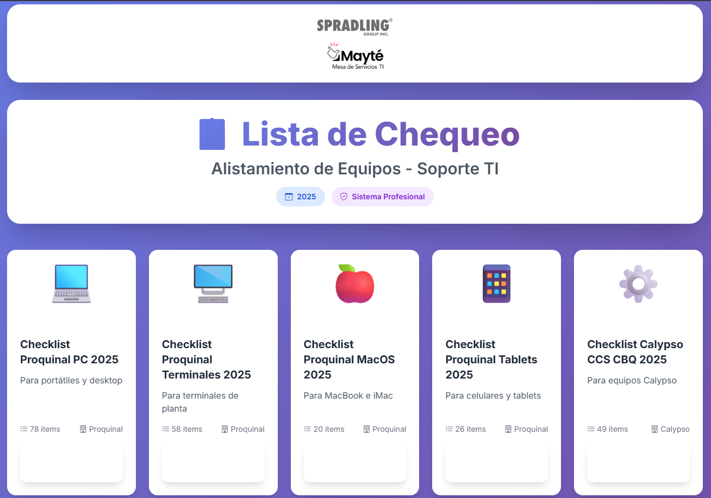
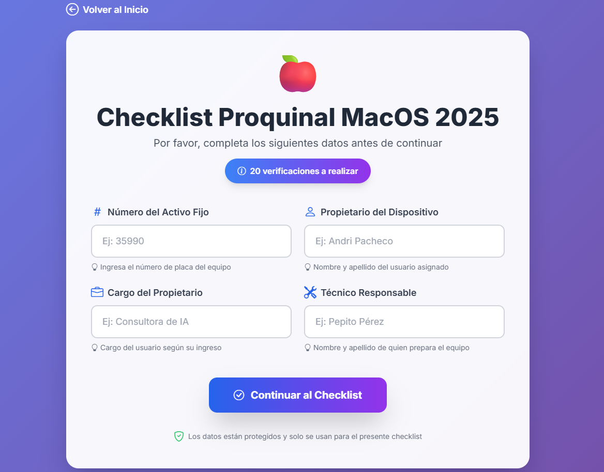
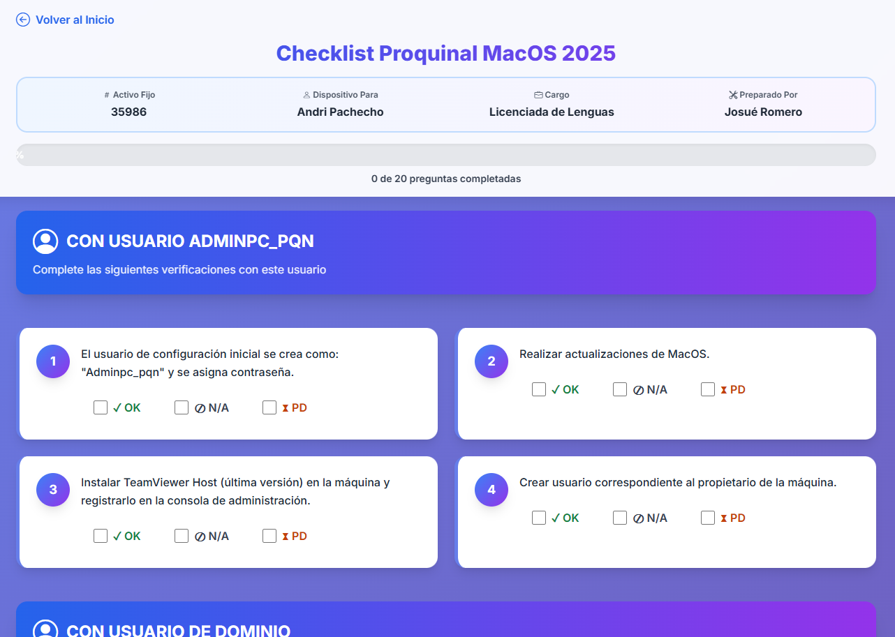

# 📋 App Checklist Proquinal - Sistema de Alistamiento de Equipos


Sistema web profesional para la gestión de checklists de alistamiento de equipos de cómputo. Desarrollado para el equipo de Soporte TI de Proquinal - SpradlingGroup.

## 🚀 Características

- ✅ **5 Tipos de Checklist**: PC, Terminales, MacOS, Tablets y Calypso
- 🎨 **Diseño Moderno**: Interface responsiva con Tailwind CSS y animaciones
- 📊 **Generación de Excel**: Exportación automática de resultados
- 🔄 **Progreso en Tiempo Real**: Barra de progreso interactiva
- 🌐 **Guardado en Red**: Almacenamiento automático en carpeta compartida
- 📱 **100% Responsive**: Compatible con desktop, tablet y móvil
- 🔐 **Sesiones Seguras**: Manejo seguro de datos del usuario

## 📸 Capturas de Pantalla

### Página Principal


### Formulario de Datos


### Checklist Interactivo


## 🛠️ Tecnologías Utilizadas

- **Backend**: Flask 3.0.0
- **Frontend**: Tailwind CSS, Bootstrap Icons, Animate.css
- **Excel**: OpenPyXL
- **Deployment**: Gunicorn, Docker
- **Environment**: python-dotenv

## 📦 Instalación

### Requisitos Previos

- Python 3.12 o superior
- pip (gestor de paquetes de Python)
- Acceso a red corporativa (para guardado en carpeta compartida)

### Pasos de Instalación

1. **Clonar el repositorio**
```bash
git clone https://github.com/josuerom/app-checklist-pqn.git
cd app-checklist_pqn
code .
```

2. **Crear entorno virtual**
```bash
python -m venv venv

# Windows
venv\Scripts\activate
# Linux/Mac
source venv/bin/activate
```

3. **Instalar dependencias**
```bash
pip install -r requirements.txt
```

4. **Configurar variables de entorno**
```bash
# Copiar archivo de ejemplo
cp .env.example .env

# Editar .env con tus configuraciones
code .env
```

5. **Ejecutar la aplicación**
```bash
python app.py
```

La aplicación estará disponible en `http://localhost:9015`

## ⚙️ Configuración

### Variables de Entorno (.env)

```bash
# Flask
FLASK_ENV=production
SECRET_KEY=tu-clave-secreta-aqui
DEBUG=False

# Server
HOST=0.0.0.0
PORT=9015

# Rutas
OUTPUT_DIR=output
SHARED_NETWORK_PATH=\\192.170.1.202\files$\Diciembre2025
TEMPLATES_DIR=templates_excel

# Empresa
DEFAULT_VALIDATOR=Nombre Apellido
COMPANY_NAME=Proquinal - SpradlingGroup
SUPPORT_EMAIL=pepe.perez@spradling.group
```

## 📁 Estructura del Proyecto

```
app-checklist_pqn/
├── .env                            ✅
├── .gitignore                      ✅
├── Dockerfile                      ✅
├── docker-compose.yml              ✅
├── README.md                       ✅
├── requirements.txt                ✅
├── app.py                          ✅
├── bin/
│   ├── runapp.sh                   ✅
│   └── runapp.bat                  ✅
│
├── config/
│   ├── __pycache__/
│   └── settings.py                 ✅
│
├── app/
│   ├── __init__.py                 ✅
│   ├── routes/
│   │   ├── main.py                 ✅
│   │   └── checklist.py            ✅
│   ├── services/
│   │   ├── excel_service.py        ✅
│   │   └── file_service.py         ✅
│   ├── models/
│   │   └── checklist_data.py       ✅
│   └── utils/
│       └── helpers.py              ✅
│
├── static/
│   ├── css/
│   │   └── styles.css              ✅
│   ├── js/
│   │   ├── main.js                 ✅
│   │   └── checklist.js            ✅
│   └── img/
│       ├── spradling-mayte.png
│       ├── stefanini.png
│       ├── proquinal.png
│       ├── capture_1.png
│       ├── capture_2.png
│       └── capture_3.png
│
├── templates/
│   ├── base.html                   ✅
│   ├── components/
│   │   ├── navbar.html             ✅
│   │   └── footer.html             ✅
│   ├── pages/
│   │   ├── index.html              ✅
│   │   ├── checklist_form.html     ✅
│   │   └── checklist.html          ✅
│   └── errors/
│       ├── 404.html                ✅
│       └── 500.html                ✅
│
├── templates_excel/
│   ├── plantilla_pc.xlsx
│   ├── plantilla_terminales.xlsx
│   ├── plantilla_macos.xlsx
│   ├── plantilla_tablets.xlsx
│   └── plantilla_calypso.xlsx
│
├── tests/
│   └── test_services.py            ✅
│
├── output/
│   └── .gitkeep                    ✅
└── logs/
│   └── logs.txt                    ✅
```

## 🐳 Docker

### Construir imagen
```bash
docker build -t app-checklist:latest .
```

### Ejecutar contenedor
```bash
docker run -d -p 9015:9015 --name checklist-app app-checklist:latest
```

## 📖 Uso

### 1. Seleccionar Tipo de Checklist
Desde la página principal, selecciona el tipo de checklist que necesitas:
- 💻 Portátil/PC
- 🖥️ Terminales
- 🍎 MacOS
- 📱 Tablets
- ⚙️ Calypso

### 2. Completar Datos Iniciales
Ingresa la información del equipo:
- Número de activo fijo
- Propietario del dispositivo
- Cargo del propietario
- Técnico responsable

### 3. Completar Checklist
Marca cada ítem como:
- ✓ **OK**: Completado
- ⊘ **N/A**: No aplica
- ⧗ **PD**: Pendiente

### 4. Generar Archivo
Al completar todas las verificaciones, el sistema:
1. Genera un archivo Excel con los resultados
2. Lo guarda en la carpeta local `output/`
3. Lo copia automáticamente a la carpeta compartida de red

## 🔧 Desarrollo

### Ejecutar en modo desarrollo
```bash
export FLASK_ENV=development
export DEBUG=True
python app.py
```

### Ejecutar tests
```bash
pytest tests/
```

## 📝 Logs

Los logs se guardan en `logs/logs.txt` con el siguiente formato:
```
[2025-12-12 15:30:45] INFO in main: Aplicación Flask iniciada correctamente
[2025-12-12 15:31:20] INFO in checklist: Formulario completado - Tipo: pc, Activo: 35990
```

## 🤝 Contribución

1. Fork el proyecto
2. Crea una rama para tu feature (`git checkout -b feature/AmazingFeature`)
3. Commit tus cambios (`git commit -m 'Add some AmazingFeature'`)
4. Push a la rama (`git push origin feature/AmazingFeature`)
5. Abre un Pull Request

## 👤 Autor

- Email: josue.romero@spradling.group
- Teléfono: 310 864 3149
- Empresa: Stefanini Group CO - Proquinal S.A.S

## 📄 Licencia

Este proyecto es propiedad de **Josué Romero**. Todos los derechos reservados © 2026

## 🙏 Agradecimientos

- Equipo de IT Proquinal
- Equipo Stefanini presente en SpradlingGroup

---